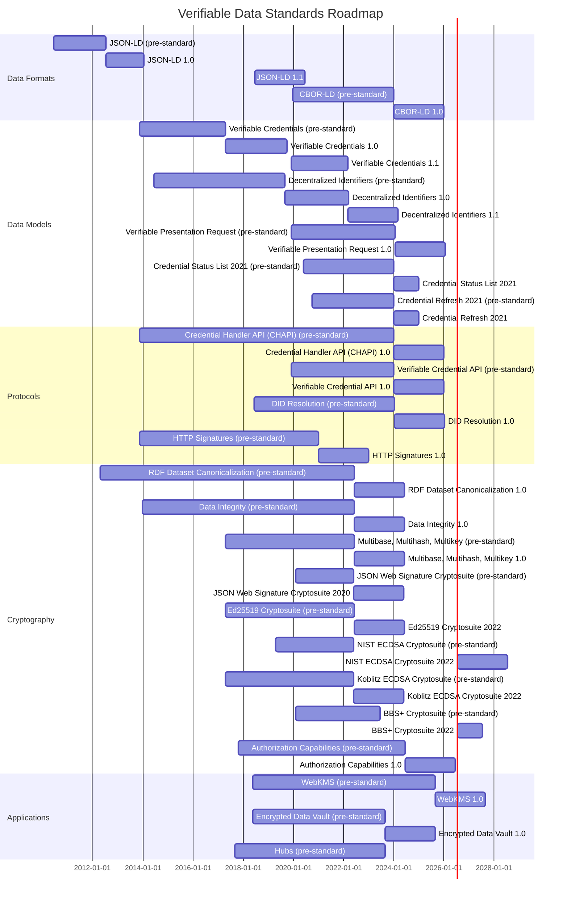

# The Verifiable Data Standards Roadmap

```mermaid
gantt
    title Verifiable Data Standards Roadmap
    dateFormat  YYYY-MM-DD
    section Data Formats
    JSON-LD (pre-standard) :j0, 2010-06-12, 2012-07-12
    JSON-LD 1.0 :j1, 2012-07-12, 2014-01-16
    JSON-LD 1.1	:j11, 2018-06-15, 2020-06-15
    CBOR-LD (pre-standard) :active c0, 2019-12-28, 2023-12-30
    CBOR-LD 1.0 :c1, 2023-12-31, 730d
    section Data Models   
    Verifiable Credentials (pre-standard): vc0, 2013-11-17, 2017-04-14
    Verifiable Credentials 1.0 :vc1, 2017-04-14, 2019-09-30
    Verifiable Credentials 1.1 :vc11, 2019-11-30, 2022-03-03
    Decentralized Identifiers (pre-standard) :did0, 2014-06-14, 2019-09-01
    Decentralized Identifiers 1.0 :did1, 2019-09-01, 2022-03-15
    Decentralized Identifiers 1.1 :did11, 2022-03-09, 2024-03-09
    Verifiable Presentation Request (pre-standard) :vpr0, 2019-11-30, 2024-01-18
    Verifiable Presentation Request 1.0 :vpr1, after vpr0, 730d
    Credential Status List 2021 (pre-standard) :csl0, 2020-05-30, 2024-01-01
    Credential Status List 2021 :csl2021, after csl0, 365d
    Credential Refresh 2021 (pre-standard) :cr0, 2020-09-30, 2024-01-01
    Credential Refresh 2021 :cr2021, after cr0, 365d
    section Protocols
    Credential Handler API (CHAPI) (pre-standard) :chapi0, 2013-11-17, 2023-12-30
    Credential Handler API (CHAPI) 1.0 :chapi1, after chapi0, 730d
    Verifiable Credential API (pre-standard) :vcapi0, 2019-11-30, 2024-01-05
    Verifiable Credential API 1.0 :vcapi1, after vcapi0, 730d
    DID Resolution (pre-standard) :didr0, 2018-06-14, 2024-01-08
    DID Resolution 1.0 :didr1, after didr0, 730d
    HTTP Signatures (pre-standard) :hs0, 2013-11-17, 2020-12-30
    HTTP Signatures 1.0 :hs1, after hs0, 730d
    section Cryptography
    RDF Dataset Canonicalization (pre-standard) :rdc0, 2012-04-15, 2022-06-06
    RDF Dataset Canonicalization 1.0 :rdc1, after rdc0, 730d
    Data Integrity (pre-standard) :di0, 2013-12-23, 2022-06-06
    Data Integrity 1.0 :di1, after di0, 730d
    Multibase, Multihash, Multikey (pre-standard) :mf0, 2017-04-15, 2022-06-06
    Multibase, Multihash, Multikey 1.0 :mf1, after mf0, 730d
    JSON Web Signature Cryptosuite (pre-standard) :jws0, 2020-02-04, 2022-06-01
    JSON Web Signature Cryptosuite 2020 :jws2020, after jws0, 730d
    Ed25519 Cryptosuite (pre-standard) :eddsa0, 2017-04-15, 2022-06-06
    Ed25519 Cryptosuite 2022 :eddsa2022, after eddsa0, 730d
    NIST ECDSA Cryptosuite (pre-standard) :nist-ecdsa0, 2019-04-15, 2022-05-31
    NIST ECDSA Cryptosuite 2022 :nist-ecdsa2022, after ecdsa0, 730d
    Koblitz ECDSA Cryptosuite (pre-standard) :koblitz-ecdsa0, 2017-04-15, 2022-05-31
    Koblitz ECDSA Cryptosuite 2022 :koblitz-ecdsa2022, 2022-06-01, 730d
    BBS+ Cryptosuite (pre-standard) :bbs+0, 2020-02-08, 2023-06-19
    BBS+ Cryptosuite 2022 :bbs+2022, after bbs+0, 365d
    Authorization Capabilities (pre-standard) :zcap0, 2017-10-22, 2024-06-16
    Authorization Capabilities 1.0 :zcap1, after zcap0, 730d
    section Applications
    WebKMS (pre-standard) :webkms0, 2018-05-15, 2025-09-01
    WebKMS 1.0 :webkms1, after webkms0, 730d
    Encrypted Data Vault (pre-standard) :edv0, 2018-05-15, 2023-09-01
    Encrypted Data Vault 1.0 :edv1, after edv0, 730d
    Hubs (pre-standard) :hubs0, 2017-09-01, 2023-08-25
```
